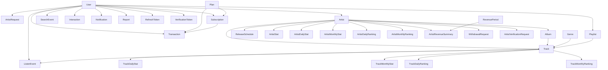

# MODEL OVERVIEW

## 1. Mục tiêu tài liệu

Tài liệu này dùng để khái quát toàn bộ các model hiện có trong backend, giúp team nhanh chóng nắm được:

- Project đang có **32 model Mongoose chính** trong `src/models`
- Model nào là **nguồn dữ liệu gốc**
- Model nào là **log hành vi**
- Model nào là **dữ liệu tổng hợp / ranking / doanh thu** được sinh ra từ job hoặc cron
- Quan hệ chính giữa các model để phục vụ phát triển API, analytics và quản trị nội dung

## 2. Bức tranh tổng thể

Backend hiện tại xoay quanh 6 domain lớn:

1. **Identity & Access**
   - Quản lý người dùng, xác thực, token, quyền truy cập
   - Model chính: `User`, `RefreshToken`, `VerificationToken`

2. **Artist & Content Catalog**
   - Quản lý nghệ sĩ, bài hát, album, thể loại, playlist, lịch phát hành
   - Model chính: `Artist`, `Track`, `Album`, `Genre`, `Playlist`, `ReleaseSchedule`

3. **Artist Onboarding & Moderation**
   - Quản lý đăng ký nghệ sĩ, xác minh nghệ sĩ, duyệt nội dung, báo cáo vi phạm
   - Model chính: `ArtistRequest`, `ArtistVerificationRequest`, `Report`, `Notification`

4. **User Activity & Interaction**
   - Ghi nhận hành vi nghe nhạc, tìm kiếm, like/follow
   - Model chính: `ListenEvent`, `SearchEvent`, `Interaction`

5. **Subscription, Payment & Revenue**
   - Quản lý gói premium, đăng ký gói, giao dịch, kỳ doanh thu, payout nghệ sĩ
   - Model chính: `Plan`, `Subscription`, `Transaction`, `RevenuePeriod`, `ArtistRevenueSummary`, `WithdrawalRequest`

6. **Analytics & Ranking**
   - Lưu số liệu ngày/tháng, top track, top artist, thống kê toàn nền tảng
   - Model chính: `TrackDailyStat`, `TrackMonthlyStat`, `TrackDailyRanking`, `TrackMonthlyRanking`, `ArtistDailyStat`, `ArtistMonthlyStat`, `ArtistDailyRanking`, `ArtistMonthlyRanking`, `ArtistStat`, `PlatformMonthlyStat`

## 3. Luồng dữ liệu chính

### 3.1 User và artist

- `User` là thực thể gốc cho tài khoản hệ thống
- Một `User` có thể gửi `ArtistRequest` để trở thành nghệ sĩ
- Khi được duyệt, hệ thống tạo `Artist` gắn với `userId`
- Sau đó artist có thể tạo `Track`, `Album`, `ReleaseSchedule` và nhận doanh thu

### 3.2 Nội dung âm nhạc

- `Artist` sở hữu nhiều `Track`
- `Album` thuộc về một `Artist` và chứa danh sách `trackList`
- `Track` có thể tham chiếu ngược đến `Album`
- `Track` còn liên kết tới nhiều `Genre`
- `Playlist` thuộc về `User` và chứa danh sách `Track`

### 3.3 Hành vi người dùng

- Người dùng nghe bài hát tạo ra `ListenEvent`
- Tìm kiếm tạo `SearchEvent`
- Like/follow tạo `Interaction`
- Các dữ liệu này là đầu vào cho analytics, ranking và revenue calculation

### 3.4 Premium và doanh thu

- `Plan` định nghĩa gói dịch vụ
- `Subscription` lưu vòng đời đăng ký của user
- `Transaction` lưu thanh toán thực tế
- `RevenuePeriod` gom doanh thu premium theo tháng
- `TrackMonthlyStat` và `ArtistRevenueSummary` lưu phần doanh thu phân bổ
- `WithdrawalRequest` lưu yêu cầu rút tiền của artist

### 3.5 Analytics

- `ListenEvent` là nguồn dữ liệu gốc cho thống kê stream
- Cron/job tổng hợp sang:
  - `TrackDailyStat`, `TrackMonthlyStat`
  - `ArtistDailyStat`, `ArtistMonthlyStat`
  - `TrackDailyRanking`, `TrackMonthlyRanking`
  - `ArtistDailyRanking`, `ArtistMonthlyRanking`
  - `PlatformMonthlyStat`

## 4. Quan hệ trọng tâm giữa các model

## 5. Phân loại model theo vai trò

### 5.1 Core master data

Đây là các model đại diện cho dữ liệu nghiệp vụ gốc:

- `User`
- `Artist`
- `Track`
- `Album`
- `Genre`
- `Playlist`
- `Plan`

### 5.2 Workflow / moderation / lifecycle

Các model phục vụ quy trình duyệt, xác minh, lịch phát hành, thông báo:

- `ArtistRequest`
- `ArtistVerificationRequest`
- `ReleaseSchedule`
- `Report`
- `Notification`

### 5.3 Event / activity log

Các model log hành vi, thường tăng nhanh theo thời gian:

- `ListenEvent`
- `SearchEvent`
- `Interaction`
- `RefreshToken`
- `VerificationToken`

### 5.4 Billing / revenue / payout

- `Subscription`
- `Transaction`
- `RevenuePeriod`
- `ArtistRevenueSummary`
- `WithdrawalRequest`

### 5.5 Aggregated analytics / ranking

- `ArtistStat`
- `ArtistDailyStat`
- `ArtistMonthlyStat`
- `ArtistDailyRanking`
- `ArtistMonthlyRanking`
- `TrackDailyStat`
- `TrackMonthlyStat`
- `TrackDailyRanking`
- `TrackMonthlyRanking`
- `PlatformMonthlyStat`

## 6. Tóm tắt và field từng model

### 6.1 Bảng tóm tắt nhanh

| Model | Nhóm | Vai trò chính | Quan hệ / tham chiếu đáng chú ý |
|---|---|---|---|
| `User` | Identity | Tài khoản người dùng, role, profile, trạng thái premium | ref `Plan` qua `subscription.currentPlanId` |
| `RefreshToken` | Identity | Lưu refresh token đăng nhập còn hiệu lực hoặc đã revoke | ref `User` |
| `VerificationToken` | Identity | Lưu OTP/token xác minh email và reset password | ref `User` |
| `Artist` | Artist | Hồ sơ nghệ sĩ chính thức sau khi được duyệt | ref `User`, được tham chiếu bởi `Track`, `Album`, revenue/stat models |
| `ArtistRequest` | Artist Workflow | Hồ sơ đăng ký trở thành nghệ sĩ, gồm CCCD, portfolio, checklist review | ref `User`, `reviewedBy` là `User` |
| `ArtistVerificationRequest` | Artist Workflow | Yêu cầu xác minh nghệ sĩ sau khi đã có profile artist | ref `Artist`, ref `User` |
| `Genre` | Catalog | Danh mục thể loại âm nhạc | được `Track.genreIds` tham chiếu |
| `Track` | Catalog | Bài hát trung tâm của hệ thống, chứa metadata, audio files, lyrics, moderation, copyright | ref `Artist`, `Album`, `Genre`, `User` |
| `Album` | Catalog | Bộ sưu tập track của artist, lưu `trackList` có thứ tự | ref `Artist`, ref `Track` trong `trackList` |
| `Playlist` | Catalog | Playlist do user tạo hoặc hệ thống/AI sinh ra | ref `User`, ref `Track` trong `tracks` |
| `ReleaseSchedule` | Workflow | Lên lịch phát hành cho `track` hoặc `album` | ref `Artist`, `targetId` trỏ tới track/album theo `type` |
| `Notification` | Communication | Thông báo hệ thống, release, payment, follow, report, subscription | ref `User`, có `actor` và `target` metadata |
| `Report` | Moderation | Báo cáo vi phạm đối với `track`, `album`, `artist` | ref `User`, `handledBy` là `User` |
| `Interaction` | Activity | Like/follow lên `Track`, `Artist`, `Album`, `Post` | ref `User`, `targetId` dùng `refPath` |
| `ListenEvent` | Activity | Log nghe nhạc chi tiết, là nguồn dữ liệu analytics và revenue | ref `User`, `Track`, `Artist` |
| `SearchEvent` | Activity | Log từ khóa tìm kiếm và track được click | ref `User`, ref `Track` |
| `Plan` | Billing | Cấu hình gói dịch vụ premium và feature | được `User`, `Subscription`, `Transaction` tham chiếu |
| `Subscription` | Billing | Vòng đời đăng ký gói của user | ref `User`, ref `Plan` |
| `Transaction` | Billing | Giao dịch thanh toán thực tế qua gateway | ref `User`, `Subscription`, `Plan` |
| `RevenuePeriod` | Revenue | Kỳ doanh thu theo tháng của nền tảng, lưu tổng revenue pool và daily stats | ref `User` qua `confirmedBy` |
| `ArtistRevenueSummary` | Revenue | Tổng hợp doanh thu tháng cho từng artist | ref `Artist` |
| `WithdrawalRequest` | Revenue | Yêu cầu rút tiền của artist | ref `Artist`, `processedBy` là `User` |
| `ArtistStat` | Analytics | Snapshot thống kê tổng quan artist: stream, follower, demographic | ref `Artist` |
| `ArtistDailyStat` | Analytics | Stream và unique listeners theo ngày của artist | ref `Artist` |
| `ArtistMonthlyStat` | Analytics | Followers và stream theo tháng của artist | ref `Artist` |
| `ArtistDailyRanking` | Analytics | BXH artist theo ngày, tối đa 20 artist | ref `Artist` trong `rankings` |
| `ArtistMonthlyRanking` | Analytics | BXH artist theo tháng, tối đa 20 artist | ref `Artist` trong `rankings` |
| `TrackDailyStat` | Analytics | Play count, unique listeners, average listen duration, skip theo ngày | ref `Track` |
| `TrackMonthlyStat` | Analytics + Revenue | Thống kê theo tháng của track, kèm revenue chia sẻ | ref `Track` |
| `TrackDailyRanking` | Analytics | BXH track theo ngày, tối đa 100 track | ref `Track` trong `rankings` |
| `TrackMonthlyRanking` | Analytics | BXH track theo tháng, tối đa 100 track | ref `Track` trong `rankings` |
| `PlatformMonthlyStat` | Analytics | Tổng hợp KPI toàn nền tảng theo tháng và daily breakdown | ref `Track`, `Artist` trong `dailyStats.top*` |

### 6.2 Chi tiết field của từng model

#### Identity & Access

**`User`**

- `email: String`
- `password: String`
- `authProvider: "local" | "google"`
- `googleId: String`
- `avatar: String`
- `role: "user" | "artist" | "admin"`
- `activeStatus: "active" | "inactive" | "blocked"`
- `blockReason: String`
- `emailVerified: Boolean`
- `profile.fullName: String`
- `profile.gender: "male" | "female" | "other" | "prefer_not_to_say"`
- `profile.dateOfBirth: Date`
- `profile.country: String`
- `settings.language: String`
- `settings.notificationsEnabled: Boolean`
- `settings.shufflePlayDefault: Boolean`
- `subscription.isPremium: Boolean`
- `subscription.currentPlanId: ObjectId -> Plan`
- `subscription.premiumEndDate: Date`
- `stats.totalListeningTime: Number`
- `stats.totalTracksPlayed: Number`
- `createdAt`, `updatedAt`

**`RefreshToken`**

- `userId: ObjectId -> User`
- `token: String`
- `expiresAt: Date`
- `isRevoked: Boolean`
- `createdAt`, `updatedAt`

**`VerificationToken`**

- `userId: ObjectId -> User`
- `email: String`
- `token: String`
- `otp: String`
- `type: "reset_password" | "verify_email"`
- `expiresAt: Date`
- `isUsed: Boolean`
- `createdAt`, `updatedAt`

#### Artist & Content Catalog

**`Artist`**

- `userId: ObjectId -> User`
- `name: String`
- `bio: String`
- `avatar: String`
- `coverImage: String`
- `socialLinks.facebook: String`
- `socialLinks.instagram: String`
- `socialLinks.youtube: String`
- `verificationStatus: "pending" | "verified" | "rejected"`
- `stats.followers: Number`
- `stats.totalStreams: Number`
- `stats.monthlyListeners: Number`
- `revenue.totalEarnedAmount: Number`
- `revenue.totalWithdrawnAmount: Number`
- `revenue.availableAmount: Number`
- `revenue.pendingPayoutAmount: Number`
- `activeStatus: "active" | "inactive" | "blocked"`
- `blockedReason: String`
- `createdAt`, `updatedAt`

**`Genre`**

- `name: String`
- `description: String`
- `image: String`
- `isActive: Boolean`
- `createdAt`, `updatedAt`

**`Track`**

- `title: String`
- `artist_artistId: ObjectId -> Artist`
- `album_albumId: ObjectId -> Album`
- `genreIds: ObjectId[] -> Genre`
- `audioFiles[].url: String`
- `audioFiles[].format: String`
- `audioFiles[].bitrate: Number`
- `audioFiles[].label: "original" | "high" | "medium" | "low" | "lowest"`
- `audioFiles[].priority: Number`
- `duration: Number`
- `versionTitle: String`
- `avatar: String`
- `coverImage: String[]`
- `lyricsStatic: String`
- `lyricsSyncUrl: String`
- `stats.totalLike: Number`
- `stats.totalPlay: Number`
- `releaseDate: Date`
- `activeStatus: "draft" | "active" | "inactive" | "hidden" | "blocked"`
- `approvalStatus: "draft" | "pending" | "approved" | "rejected"`
- `copyright.copyrightOwner: String`
- `copyright.recordingOwner: String`
- `copyright.composer: String`
- `copyright.lyricist: String`
- `copyright.producer: String`
- `copyright.isOriginal: Boolean`
- `copyright.isCover: Boolean`
- `copyright.isRemix: Boolean`
- `copyright.usesSample: Boolean`
- `copyright.usesLicensedBeat: Boolean`
- `copyright.originalTrackTitle: String`
- `copyright.originalArtistName: String`
- `copyright.licenseDocumentUrls: String[]`
- `copyright.declarationAccepted: Boolean`
- `copyright.copyrightStatus: "pending" | "verified" | "rejected" | "disputed"`
- `copyright.copyrightNote: String`
- `moderation.submittedAt: Date`
- `moderation.reviewedBy: ObjectId -> User`
- `moderation.reviewedAt: Date`
- `moderation.adminNote: String`
- `moderation.violationFlags: ("copyright" | "missing_rights_proof" | "wrong_metadata" | "low_audio_quality" | "explicit_content" | "duplicate_track" | "other")[]`
- `rejectReason: String`
- `blockedReason: String`
- `hiddenReason: String`
- `hiddenAt: Date`
- `createdAt`, `updatedAt`

**`Album`**

- `title: String`
- `artistId: ObjectId -> Artist`
- `coverImage: String`
- `trackList[].trackId: ObjectId -> Track`
- `trackList[].order: Number`
- `releaseDate: Date`
- `status: "draft" | "active" | "hidden" | "blocked"`
- `blockedReason: String`
- `totalDuration: Number`
- `createdAt`, `updatedAt`

**`Playlist`**

- `userId: ObjectId -> User`
- `title: String`
- `description: String`
- `type: "user" | "system" | "ai_generated"`
- `coverImage: String`
- `isPublic: Boolean`
- `isHidden: Boolean`
- `aiPrompt: String`
- `aiGeneratedAt: Date`
- `trackCount: Number`
- `totalDuration: Number`
- `tracks[].trackId: ObjectId -> Track`
- `tracks[].addedAt: Date`
- `tracks[].order: Number`
- `createdAt`, `updatedAt`

**`ReleaseSchedule`**

- `type: "track" | "album"`
- `targetId: ObjectId`
- `artistId: ObjectId -> Artist`
- `scheduledAt: Date`
- `releasedAt: Date`
- `status: "scheduled" | "released" | "cancelled"`
- `createdAt`, `updatedAt`

#### Artist Workflow, Moderation & Communication

**`ArtistRequest`**

- `userId: ObjectId -> User`
- `stageName: String`
- `bio: String`
- `avatar: String`
- `genres: String[]`
- `socialLinks.spotify: String`
- `socialLinks.youtube: String`
- `socialLinks.tiktok: String`
- `socialLinks.facebook: String`
- `socialLinks.instagram: String`
- `socialLinks.soundcloud: String`
- `socialLinks.website: String`
- `socialLinks.other: String`
- `identityInfo.idNumber: String`
- `identityInfo.fullName: String`
- `identityInfo.dateOfBirth: Date`
- `identityInfo.frontImage: String`
- `identityInfo.backImage: String`
- `portfolio.demoTrackUrls: String[]`
- `portfolio.musicLinks: String[]`
- `portfolio.description: String`
- `artistDeclaration.acceptedTerms: Boolean`
- `artistDeclaration.copyrightCommitment: Boolean`
- `artistDeclaration.truthfulInformationCommitment: Boolean`
- `artistDeclaration.acceptedAt: Date`
- `review.adminNote: String`
- `review.checklist.profileComplete: Boolean`
- `review.checklist.identityVerified: Boolean`
- `review.checklist.hasMusicActivity: Boolean`
- `review.checklist.socialLinksValid: Boolean`
- `review.checklist.noImpersonation: Boolean`
- `review.checklist.acceptedCopyrightPolicy: Boolean`
- `status: "pending" | "approved" | "rejected"`
- `reviewedBy: ObjectId -> User`
- `reviewedAt: Date`
- `rejectReason: String`
- `createdAt`, `updatedAt`

**`ArtistVerificationRequest`**

- `artistId: ObjectId -> Artist`
- `userId: ObjectId -> User`
- `status: "open" | "closed"`
- `note: String`
- `createdAt`, `updatedAt`

**`Notification`**

- `userId: ObjectId -> User`
- `type: "system" | "new_release" | "payment" | "follow" | "report" | "subscription"`
- `title: String`
- `content: String`
- `isRead: Boolean`
- `actorId: ObjectId`
- `actorType: "admin" | "artist" | "system" | "user" | ""`
- `targetId: ObjectId`
- `targetType: "track" | "album" | "plan" | "payment" | "report" | "artist" | ""`
- `receiverType: "single" | "all" | "group"`
- `isGlobal: Boolean`
- `createdBy: ObjectId -> User`
- `isDeleted: Boolean`
- `deletedAt: Date`
- `createdAt`, `updatedAt`

**`Report`**

- `userId: ObjectId -> User`
- `targetId: ObjectId`
- `targetType: "track" | "album" | "artist"`
- `reason: String`
- `description: String`
- `images: String[]`
- `status: "pending" | "reviewing" | "resolved" | "rejected"`
- `handledBy: ObjectId -> User`
- `handledAt: Date`
- `resolution: "remove_content" | "ignore" | "warning" | ""`
- `resolutionNote: String`
- `createdAt`, `updatedAt`

#### User Activity & Interaction

**`Interaction`**

- `userId: ObjectId -> User`
- `targetType: "Track" | "Artist" | "Album" | "Post"`
- `targetId: ObjectId`
- `action: "like" | "follow"`
- `createdAt`

**`ListenEvent`**

- `userId: ObjectId -> User`
- `trackId: ObjectId -> Track`
- `artistId: ObjectId -> Artist`
- `listenedAt: Date`
- `trackDuration: Number`
- `listenedDuration: Number`
- `listenPercent: Number`
- `dailyListenOrder: Number`
- `requiredPercent: Number`
- `source: "track_detail" | "album" | "playlist" | "search" | "artist_profile" | "unknown"`
- `isValidStream: Boolean`
- `duration: Number`
- `completed: Boolean`
- `skipped: Boolean`
- `device: String`
- `country: String`
- `createdAt`, `updatedAt`

**`SearchEvent`**

- `userId: ObjectId -> User`
- `keyword: String`
- `clickedTrackId: ObjectId -> Track`
- `createdAt`

#### Billing, Subscription & Revenue

**`Plan`**

- `name: String`
- `price: Number`
- `durationDays: Number`
- `description: String`
- `features: ("NO_ADS" | "HIGH_QUALITY_AUDIO" | "LOSSLESS_AUDIO" | "UNLIMITED_SKIP" | "OFFLINE_DOWNLOAD" | "BACKGROUND_PLAY" | "AI_SMART_PLAYLIST" | "ADVANCED_RECOMMENDATION" | "EARLY_ACCESS" | "EXCLUSIVE_CONTENT")[]`
- `status: "active" | "inactive"`
- `createdAt`, `updatedAt`

**`Subscription`**

- `userId: ObjectId -> User`
- `planId: ObjectId -> Plan`
- `status: "pending" | "active" | "cancelled" | "expired"`
- `startDate: Date`
- `endDate: Date`
- `autoRenew: Boolean`
- `createdAt`, `updatedAt`

**`Transaction`**

- `userId: ObjectId -> User`
- `subscriptionId: ObjectId -> Subscription`
- `planId: ObjectId -> Plan`
- `amount: Number`
- `tax: Number`
- `totalAmount: Number`
- `currency: String`
- `paymentMethod: "momo" | "vnpay" | "stripe" | "card"`
- `paymentGateway: "momo" | "vnpay" | "stripe"`
- `gatewayTransactionId: String`
- `status: "pending" | "success" | "failed" | "refunded"`
- `paidAt: Date`
- `failedAt: Date`
- `failureReason: String`
- `invoiceNumber: String`
- `createdAt`, `updatedAt`

**`RevenuePeriod`**

- `year: Number`
- `month: Number`
- `periodStart: Date`
- `periodEnd: Date`
- `status: "open" | "closed" | "calculated" | "confirmed"`
- `totalPremiumRevenue: Number`
- `totalArtistPool: Number`
- `totalPlatformRevenue: Number`
- `totalEligibleStreams: Number`
- `successfulTransactions: Number`
- `dailyStats[].day: Number`
- `dailyStats[].date: Date`
- `dailyStats[].premiumRevenue: Number`
- `dailyStats[].artistPool: Number`
- `dailyStats[].platformRevenue: Number`
- `dailyStats[].successfulTransactions: Number`
- `lastAggregatedAt: Date`
- `closedAt: Date`
- `calculatedAt: Date`
- `confirmedAt: Date`
- `confirmedBy: ObjectId -> User`
- `createdAt`, `updatedAt`

**`ArtistRevenueSummary`**

- `artistId: ObjectId -> Artist`
- `year: Number`
- `month: Number`
- `totalEligibleStreams: Number`
- `grossRevenueAmount: Number`
- `artistRevenueAmount: Number`
- `platformRevenueAmount: Number`
- `withdrawnAmount: Number`
- `availableAmount: Number`
- `status: "pending" | "calculated" | "paid"`
- `calculatedAt: Date`
- `createdAt`, `updatedAt`

**`WithdrawalRequest`**

- `artistId: ObjectId -> Artist`
- `amount: Number`
- `method: "bank" | "momo"`
- `accountInfo.bankName: String`
- `accountInfo.accountNumber: String`
- `accountInfo.accountHolderName: String`
- `status: "pending" | "approved" | "rejected" | "paid"`
- `requestedAt: Date`
- `processedBy: ObjectId -> User`
- `processedAt: Date`
- `adminNote: String`
- `rejectReason: String`
- `createdAt`, `updatedAt`

#### Analytics, Aggregation & Ranking

**`ArtistStat`**

- `artistId: ObjectId -> Artist`
- `totalStreams: Number`
- `totalFollowers: Number`
- `monthlyListeners: Number`
- `demographics.ageGroups: Mixed`
- `demographics.gender: Mixed`
- `demographics.countries: Mixed`
- `createdAt`, `updatedAt`

**`ArtistDailyStat`**

- `artistId: ObjectId -> Artist`
- `dateKey: String`
- `date: Date`
- `streamCount: Number`
- `uniqueListeners: Number`
- `createdAt`, `updatedAt`

**`ArtistMonthlyStat`**

- `artistId: ObjectId -> Artist`
- `year: Number`
- `month: Number`
- `newFollowers: Number`
- `totalFollowers: Number`
- `totalStreams: Number`
- `createdAt`, `updatedAt`

**`ArtistDailyRanking`**

- `dateKey: String`
- `date: Date`
- `rankings[].artistId: ObjectId -> Artist`
- `rankings[].playCount: Number`
- `rankings[].uniqueListeners: Number`
- `rankings[].completedPlayCount: Number`
- `rankings[].totalTracksPlayed: Number`
- `rankings[].score: Number`
- `rankings[].rank: Number`
- `createdAt`, `updatedAt`

**`ArtistMonthlyRanking`**

- `year: Number`
- `month: Number`
- `rankings[].artistId: ObjectId -> Artist`
- `rankings[].playCount: Number`
- `rankings[].uniqueListeners: Number`
- `rankings[].completedPlayCount: Number`
- `rankings[].totalTracksPlayed: Number`
- `rankings[].score: Number`
- `rankings[].rank: Number`
- `createdAt`, `updatedAt`

**`TrackDailyStat`**

- `trackId: ObjectId -> Track`
- `dateKey: String`
- `date: Date`
- `playCount: Number`
- `uniqueListeners: Number`
- `averageListenDuration: Number`
- `skipCount: Number`
- `createdAt`, `updatedAt`

**`TrackMonthlyStat`**

- `trackId: ObjectId -> Track`
- `year: Number`
- `month: Number`
- `playCount: Number`
- `uniqueListeners: Number`
- `revenue.eligibleStreams: Number`
- `revenue.grossRevenueAmount: Number`
- `revenue.artistRevenueAmount: Number`
- `revenue.platformRevenueAmount: Number`
- `revenue.revenueSharePercent: Number`
- `revenue.calculatedAt: Date`
- `createdAt`, `updatedAt`

**`TrackDailyRanking`**

- `dateKey: String`
- `date: Date`
- `rankings[].trackId: ObjectId -> Track`
- `rankings[].playCount: Number`
- `rankings[].uniqueListeners: Number`
- `rankings[].averageListenDuration: Number`
- `rankings[].skipCount: Number`
- `rankings[].rank: Number`
- `rankings[].previousRank: Number`
- `rankings[].rankChange: Number`
- `rankings[].rankTrend: "up" | "down" | "same" | "new"`
- `createdAt`, `updatedAt`

**`TrackMonthlyRanking`**

- `year: Number`
- `month: Number`
- `rankings[].trackId: ObjectId -> Track`
- `rankings[].playCount: Number`
- `rankings[].uniqueListeners: Number`
- `rankings[].rank: Number`
- `createdAt`, `updatedAt`

**`PlatformMonthlyStat`**

- `year: Number`
- `month: Number`
- `periodStart: Date`
- `periodEnd: Date`
- `userStats.newUsers: Number`
- `userStats.totalUsers: Number`
- `artistStats.totalArtists: Number`
- `streamingStats.totalStreams: Number`
- `streamingStats.trackStreams: Number`
- `streamingStats.totalListeningTime: Number`
- `dailyStats[].date: String`
- `dailyStats[].totalStreams: Number`
- `dailyStats[].uniqueUsers: Number`
- `dailyStats[].totalListeningTime: Number`
- `dailyStats[].topTracks[].trackId: ObjectId -> Track`
- `dailyStats[].topTracks[].title: String`
- `dailyStats[].topTracks[].streamCount: Number`
- `dailyStats[].topArtists[].artistId: ObjectId -> Artist`
- `dailyStats[].topArtists[].streamCount: Number`
- `createdAt`, `updatedAt`

## 7. Các model quan trọng nhất theo nghiệp vụ

Nếu cần hiểu project nhanh, nên đọc theo thứ tự sau:

1. `User`
2. `Artist`
3. `Track`
4. `Album`
5. `Playlist`
6. `ListenEvent`
7. `Subscription`
8. `Transaction`
9. `RevenuePeriod`
10. `TrackMonthlyStat`
11. `ArtistRevenueSummary`

Đây là chuỗi model phản ánh gần như toàn bộ nghiệp vụ chính của hệ thống: tài khoản, phát hành nhạc, hành vi nghe, premium, thanh toán và chia doanh thu.

## 8. Một số quy ước thiết kế đang dùng

### 8.1 Mongoose + ref

- Tất cả model đang dùng `mongoose.Schema` và `model(...)`
- Quan hệ giữa các collection được biểu diễn bằng `ObjectId` + `ref`
- Chưa có một lớp ORM relation abstraction riêng; logic liên kết chủ yếu nằm ở service/controller

### 8.2 Nhiều dữ liệu analytics được pre-aggregate

- Hệ thống không chỉ lưu raw event (`ListenEvent`) mà còn lưu thêm các bảng tổng hợp ngày/tháng
- Điều này phù hợp cho dashboard, ranking, revenue calculation và báo cáo artist/admin

### 8.3 Status-based workflow khá nhiều

Nhiều model dùng `status` hoặc field tương đương để quản lý vòng đời:

- `User.activeStatus`
- `Artist.verificationStatus`, `Artist.activeStatus`
- `ArtistRequest.status`
- `ArtistVerificationRequest.status`
- `Track.activeStatus`, `Track.approvalStatus`
- `Album.status`
- `ReleaseSchedule.status`
- `Report.status`
- `Subscription.status`
- `Transaction.status`
- `RevenuePeriod.status`
- `ArtistRevenueSummary.status`
- `WithdrawalRequest.status`

## 9. Điểm đáng chú ý khi phát triển tiếp

### 9.1 `Track` là model giàu nghiệp vụ nhất

`Track` hiện đang chứa nhiều mảng dữ liệu cùng lúc:

- Metadata nội dung
- File audio nhiều chất lượng
- Lyrics
- Copyright declaration
- Moderation review
- Trạng thái xuất bản
- Chỉ số tương tác

Đây là model cần cẩn thận nhất khi thêm tính năng mới.

### 9.2 Một số naming chưa hoàn toàn đồng nhất

Ví dụ:

- `Track.artist_artistId`
- `Track.album_albumId`
- Trong khi các model khác chủ yếu dùng `artistId`, `planId`, `userId`, `trackId`

Nếu sau này refactor hoặc viết tài liệu API/public contract, nên thống nhất naming để giảm nhầm lẫn.

### 9.3 Analytics và revenue phụ thuộc mạnh vào cron/job

Các model thống kê như `TrackDailyStat`, `ArtistMonthlyRanking`, `PlatformMonthlyStat`, `RevenuePeriod`, `ArtistRevenueSummary` không phải dữ liệu người dùng nhập trực tiếp, mà chủ yếu được cập nhật bởi service nền và cron job.

Khi debug sai lệch số liệu, cần kiểm tra thêm:

- Job tổng hợp
- Dữ liệu nguồn từ `ListenEvent`
- Logic tính stream hợp lệ `isValidStream`
- Quy tắc chia doanh thu

## 10. Kết luận ngắn

Về bản chất, project này có thể được hiểu như sau:

- `User` là trung tâm tài khoản
- `Artist` và `Track` là trung tâm nội dung
- `ListenEvent` là trung tâm dữ liệu hành vi
- `Subscription` và `Transaction` là trung tâm thanh toán
- `RevenuePeriod`, `TrackMonthlyStat`, `ArtistRevenueSummary` là trung tâm chia doanh thu
- Nhóm `Daily/Monthly Stat + Ranking` là lớp dữ liệu tổng hợp phục vụ dashboard và báo cáo

Chỉ cần nắm chắc các nhóm model trên, ta có thể định vị khá nhanh hầu hết luồng nghiệp vụ trong project.
