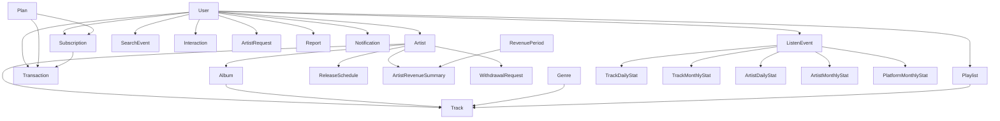

# PROJECT MODEL OVERVIEW

## 1. Scope

Tai thoi diem hien tai, backend co **35 model schema** trong `src/models` (khong tinh `index.js`).

`src/models/index.js` con export them 2 alias:

- `RecentListeningActivity` -> `UserRecentListeningActivity`
- `UserRecentListeningInsights` -> `UserRecentListeningInsightsCache`

Tai lieu nay tap trung vao:

- Vai tro cua tung model
- Quan he chinh giua cac model
- Model nao la du lieu goc, du lieu event, du lieu aggregate, hay cache
- Nhung diem can luu y khi doc code hoac mo rong schema

## 2. Buc tranh tong the

Backend hien tai xoay quanh 6 nhom domain:

| Domain | Muc dich | Model chinh |
|---|---|---|
| Identity & Access | Tai khoan, dang nhap, xac minh | `User`, `RefreshToken`, `VerificationToken` |
| Artist & Catalog | Nghe si, bai hat, album, playlist, lich phat hanh | `Artist`, `Track`, `Album`, `Genre`, `Playlist`, `ReleaseSchedule` |
| Workflow & Moderation | Dang ky nghe si, verify, report, notification | `ArtistRequest`, `ArtistVerificationRequest`, `Report`, `Notification` |
| Activity & Personalization | Hanh vi nghe, tim kiem, like/follow, recent listening | `ListenEvent`, `SearchEvent`, `Interaction`, `UserRecentListeningActivity`, `UserRecentListeningInsightsCache`, `UserListeningDailyStat` |
| Billing & Revenue | Goi premium, subscription, transaction, chia doanh thu, rut tien | `Plan`, `Subscription`, `Transaction`, `RevenuePeriod`, `ArtistRevenueSummary`, `WithdrawalRequest` |
| Analytics & Ranking | So lieu tong hop ngay/thang cho artist, track, platform | `ArtistStat`, `ArtistDailyStat`, `ArtistMonthlyStat`, `ArtistDailyRanking`, `ArtistMonthlyRanking`, `TrackDailyStat`, `TrackMonthlyStat`, `TrackDailyRanking`, `TrackMonthlyRanking`, `PlatformMonthlyStat` |

## 3. Luong du lieu chinh

1. `User` la thuc the tai khoan goc. Tu day nguoi dung co the mua `Plan`, tao `Playlist`, nghe `Track`, gui `ArtistRequest`, tao `Report`.
2. `Artist` la profile nghe si duoc gan voi `User`. Artist so huu `Track`, `Album`, `ReleaseSchedule` va phat sinh doanh thu.
3. `ListenEvent`, `SearchEvent`, `Interaction` la du lieu hanh vi goc. Day la input cho dashboard, ranking, recent listening va revenue.
4. `Subscription` va `Transaction` la luong premium. `RevenuePeriod` dong vai tro gom doanh thu theo thang, sau do chia ve `ArtistRevenueSummary`.
5. Nhom `DailyStat`, `MonthlyStat`, `Ranking`, `PlatformMonthlyStat` la lop du lieu aggregate duoc sinh boi service/job, khong phai du lieu nhap tay.
6. `UserRecentListeningActivity`, `UserRecentListeningInsightsCache`, `UserListeningDailyStat` la lop phuc vu tinh nang ca nhan hoa va thong ke nghe gan day cua user.

## 4. Danh muc toan bo model

### 4.1 Identity & Access

| Model | Vai tro | Ref chinh | Field / note noi bat |
|---|---|---|---|
| `User` | Tai khoan goc cua he thong | `Plan` qua `subscription.currentPlanId` | `email`, `authProvider`, `role`, `activeStatus`, `emailVerified`, `profile`, `settings`, `subscription`, `stats` |
| `RefreshToken` | Luu refresh token dang nhap | `userId -> User` | `token`, `expiresAt`, `isRevoked` |
| `VerificationToken` | Luu token/OTP verify email va reset password | `userId -> User` | `email`, `token`, `otp`, `type`, `expiresAt`, `isUsed` |

### 4.2 Artist & Catalog

| Model | Vai tro | Ref chinh | Field / note noi bat |
|---|---|---|---|
| `Artist` | Profile nghe si chinh thuc | `userId -> User` | `name`, `bio`, `socialLinks`, `verificationStatus`, `stats`, `revenue`, `payoutAccounts`, `withdrawalSecurity`, `activeStatus` |
| `Genre` | Danh muc the loai nhac | - | `name`, `description`, `image`, `isActive` |
| `Track` | Trung tam du lieu bai hat | `artist_artistId -> Artist`, `album_albumId -> Album`, `genreIds -> Genre[]`, `moderation.reviewedBy -> User` | `audioFiles`, `lyricsStatic`, `lyricsSyncUrl`, `stats`, `activeStatus`, `approvalStatus`, `copyright`, `moderation` |
| `Album` | Tap hop track cua artist | `artistId -> Artist`, `trackList.trackId -> Track` | `title`, `coverImage`, `trackList`, `releaseDate`, `status`, `totalDuration` |
| `Playlist` | Playlist cua user, system hoac AI | `userId -> User`, `tracks.trackId -> Track` | `type`, `isPublic`, `isHidden`, `aiPrompt`, `trackCount`, `totalDuration` |
| `ReleaseSchedule` | Len lich release cho track/album | `artistId -> Artist`, `targetId` | `type`, `scheduledAt`, `releasedAt`, `status` |

### 4.3 Workflow, Moderation & Communication

| Model | Vai tro | Ref chinh | Field / note noi bat |
|---|---|---|---|
| `ArtistRequest` | Ho so dang ky tro thanh nghe si | `userId -> User`, `reviewedBy -> User` | `stageName`, `identityInfo`, `portfolio`, `artistDeclaration`, `review.checklist`, `status`, `rejectReason` |
| `ArtistVerificationRequest` | Yeu cau verify nghe si sau khi da co profile | `artistId -> Artist`, `userId -> User` | `status`, `note` |
| `Notification` | Thong bao den user, nhom user, followers, hoac all | `userId -> User`, `artistId -> Artist`, `relatedTrackId -> Track`, `createdBy -> User` | `type`, `actorId`, `targetId`, `targetType`, `sourceType`, `receiverType`, `targetRoles`, `readBy`, `deletedBy`, `isGlobal` |
| `Report` | Bao cao vi pham doi voi track/album/artist | `userId -> User`, `handledBy -> User` | `targetId`, `targetType`, `reason`, `images`, `status`, `resolution`, `resolutionNote` |

### 4.4 Activity & Personalization

| Model | Vai tro | Ref chinh | Field / note noi bat |
|---|---|---|---|
| `Interaction` | Like/follow len target | `userId -> User`, `targetId` qua `refPath` | `targetType`, `action`; unique theo `userId + targetType + targetId + action` |
| `ListenEvent` | Event nghe nhac chi tiet, la du lieu goc quan trong nhat cho analytics | `userId -> User`, `trackId -> Track`, `artistId -> Artist` | `listenedAt`, `trackDuration`, `listenedDuration`, `listenPercent`, `requiredPercent`, `source`, `isValidStream`, `completed`, `skipped`, `device`, `country` |
| `SearchEvent` | Log tim kiem cua user | `userId -> User`, `clickedTrackId -> Track` | `keyword`, `createdAt` |
| `UserRecentListeningActivity` | Ban ghi nghe gan day da duoc denormalize de phuc vu UI nhanh | `userId -> User`, `trackId -> Track`, `artistId -> Artist`, `albumId -> Album` | Luu san `trackTitle`, `artistName`, `albumTitle`, `trackImage`, `listenPercent`, `source`, `listenedAt` |
| `UserRecentListeningInsightsCache` | Cache insight recent listening cua tung user | `userId -> User`, `topGenres.genreId -> Genre`, `topTracks.trackId -> Track` | `range`, `topGenres`, `topTracks`, `lastCalculatedAt`; 1 record/user |
| `UserListeningDailyStat` | Tong hop thong ke nghe cua user theo ngay | `userId -> User` | `dateKey`, `listenCount`, `totalListenedDuration`, `uniqueTracks` |

### 4.5 Billing & Revenue

| Model | Vai tro | Ref chinh | Field / note noi bat |
|---|---|---|---|
| `Plan` | Cau hinh goi premium | - | `name`, `price`, `durationDays`, `features`, `status` |
| `Subscription` | Vong doi dang ky goi cua user | `userId -> User`, `planId -> Plan` | `planSnapshot`, `status`, `startDate`, `endDate`, `autoRenew` |
| `Transaction` | Giao dich thanh toan thuc te | `userId -> User`, `subscriptionId -> Subscription`, `planId -> Plan` | `amount`, `tax`, `totalAmount`, `paymentMethod`, `paymentGateway`, `gatewayTransactionId`, `status`, `invoiceNumber` |
| `RevenuePeriod` | Ky doanh thu theo thang cua nen tang | `confirmedBy -> User` | `year`, `month`, `periodStart`, `periodEnd`, `status`, `totalPremiumRevenue`, `totalArtistPool`, `totalPlatformRevenue`, `totalEligibleStreams`, `dailyStats`, `lastAggregatedAt` |
| `ArtistRevenueSummary` | Tong doanh thu thang cua tung artist | `artistId -> Artist`, `confirmedBy -> User` | `totalEligibleStreams`, `grossRevenueAmount`, `artistRevenueAmount`, `platformRevenueAmount`, `withdrawnAmount`, `availableAmount`, `status`, `calculatedAt`, `confirmedAt` |
| `WithdrawalRequest` | Yeu cau rut tien cua artist | `artistId -> Artist`, `processedBy -> User`, `paidBy -> User` | `amount`, `method`, `accountInfo`, `status`, `requestedAt`, `approvedAt`, `rejectedAt`, `paidAt`, `paymentReference`, `paymentNote`, `adminNote`, `rejectReason` |

### 4.6 Analytics & Ranking

| Model | Vai tro | Ref chinh | Field / note noi bat |
|---|---|---|---|
| `ArtistStat` | Snapshot tong quan artist | `artistId -> Artist` | `totalStreams`, `totalFollowers`, `monthlyListeners`, `demographics` |
| `ArtistDailyStat` | Thong ke artist theo ngay | `artistId -> Artist` | `dateKey`, `streamCount`, `uniqueListeners` |
| `ArtistMonthlyStat` | Thong ke artist theo thang | `artistId -> Artist` | `year`, `month`, `newFollowers`, `totalFollowers`, `totalStreams`, `revenueAmount` |
| `ArtistDailyRanking` | BXH artist theo ngay | `rankings.artistId -> Artist` | Moi record luu toi da 20 artist; field `playCount`, `uniqueListeners`, `completedPlayCount`, `totalTracksPlayed`, `score`, `rank` |
| `ArtistMonthlyRanking` | BXH artist theo thang | `rankings.artistId -> Artist` | Cau truc giong daily ranking, toi da 20 artist |
| `TrackDailyStat` | Thong ke track theo ngay | `trackId -> Track` | `dateKey`, `playCount`, `uniqueListeners`, `averageListenDuration`, `skipCount` |
| `TrackMonthlyStat` | Thong ke track theo thang, kem revenue cap track | `trackId -> Track` | `playCount`, `uniqueListeners`, `revenue.eligibleStreams`, `revenue.revenueAmount`, `revenue.artistRevenueAmount`, `revenue.calculatedAt` |
| `TrackDailyRanking` | BXH track theo ngay | `rankings.trackId -> Track` | Moi record luu toi da 100 track; co `previousRank`, `rankChange`, `rankTrend` |
| `TrackMonthlyRanking` | BXH track theo thang | `rankings.trackId -> Track` | Moi record luu toi da 100 track; field gon hon daily ranking |
| `PlatformMonthlyStat` | KPI tong hop toan nen tang theo thang | `dailyStats.topTracks.trackId -> Track`, `dailyStats.topArtists.artistId -> Artist` | `userStats`, `artistStats`, `streamingStats`, `dailyStats`, `periodStart`, `periodEnd` |

## 5. Model goc, model event, model aggregate, model cache

### 5.1 Nguon du lieu goc

Day la cac model business can ban, thuong duoc tao/cap nhat truc tiep qua API:

- `User`
- `Artist`
- `Track`
- `Album`
- `Genre`
- `Playlist`
- `Plan`
- `Subscription`
- `Transaction`
- `ArtistRequest`
- `ArtistVerificationRequest`
- `Notification`
- `Report`
- `WithdrawalRequest`
- `ReleaseSchedule`

### 5.2 Event / activity log

Day la lop du lieu raw, tang nhanh theo thoi gian:

- `ListenEvent`
- `SearchEvent`
- `Interaction`
- `RefreshToken`
- `VerificationToken`

### 5.3 Aggregate / ranking / reporting

Day la lop du lieu duoc tinh toan boi service, cron, hoac batch job:

- `RevenuePeriod`
- `ArtistRevenueSummary`
- `ArtistStat`
- `ArtistDailyStat`
- `ArtistMonthlyStat`
- `ArtistDailyRanking`
- `ArtistMonthlyRanking`
- `TrackDailyStat`
- `TrackMonthlyStat`
- `TrackDailyRanking`
- `TrackMonthlyRanking`
- `PlatformMonthlyStat`
- `UserListeningDailyStat`

### 5.4 Cache / denormalized read model

Day la lop du lieu toi uu cho truy van va UI:

- `UserRecentListeningActivity`
- `UserRecentListeningInsightsCache`

## 6. Quan he can nho nhanh

## 7. Diem can luu y khi phat trien tiep

1. `Track` la model nghiep vu phuc tap nhat. No gom metadata, file audio, lyrics, moderation va copyright trong cung mot schema.
2. Naming chua hoan toan dong nhat: `Track` dang dung `artist_artistId` va `album_albumId`, trong khi cac model khac chu yeu dung `artistId`, `albumId`, `trackId`.
3. `Subscription` co `planSnapshot`, nghia la can phan biet giua goi hien tai (`Plan`) va snapshot goi tai thoi diem user mua.
4. `Notification` khong chi la thong bao 1-1; no con ho tro `all`, `group`, `followers`, va tracking `readBy`/`deletedBy`.
5. `UserRecentListeningActivity` va `UserRecentListeningInsightsCache` la read-model/cache, khong nen xem la source of truth duy nhat cho listening analytics.
6. Cac model ranking/stat/revenue phu thuoc rat manh vao logic service/job. Khi sai lech so lieu, can debug tu `ListenEvent`, `Transaction`, job aggregate, roi moi toi bang tong hop.

## 8. Neu can doc code theo thu tu nao

Neu muon hieu nhanh he thong, nen doc theo thu tu sau:

1. `User`
2. `Artist`
3. `Track`
4. `Album`
5. `ListenEvent`
6. `Subscription`
7. `Transaction`
8. `RevenuePeriod`
9. `ArtistRevenueSummary`
10. `TrackMonthlyStat`
11. `UserRecentListeningActivity`
12. `UserRecentListeningInsightsCache`

Thu tu nay di tu business core -> event raw -> thanh toan -> doanh thu -> aggregate -> personalization.
